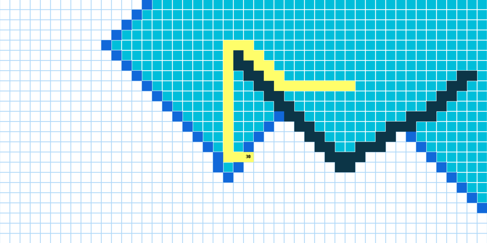

# Path-Visualization
A project written using the pygame framework. 
The project implements 4 algorithms for finding paths in the graph: BFS, DFS, Dijkstra, A*.

## Installation
Install dependencies:

    pip install -r requirements.txt

Run the project

    python main.py

## Hotkeys 

| Hotkey |                   Action                   |
|:------:|:------------------------------------------:|
| Key_1  | Visualize BFS                              |
| Key_2  | Visualize DFS                              |
| Key_3  | Visualize Dijkstra                         |
| Key_4  | Visualize A*                               |
| Key_C  | Clear the screen                           |
| Key_R  | Refresh the screen. Reset to initial state |
| Key_W  | Assign weights to nodes                    |
| Key_T  | Toggle weight display                      |

Before visalizing new algorithm the grid should be refreshed or cleared.